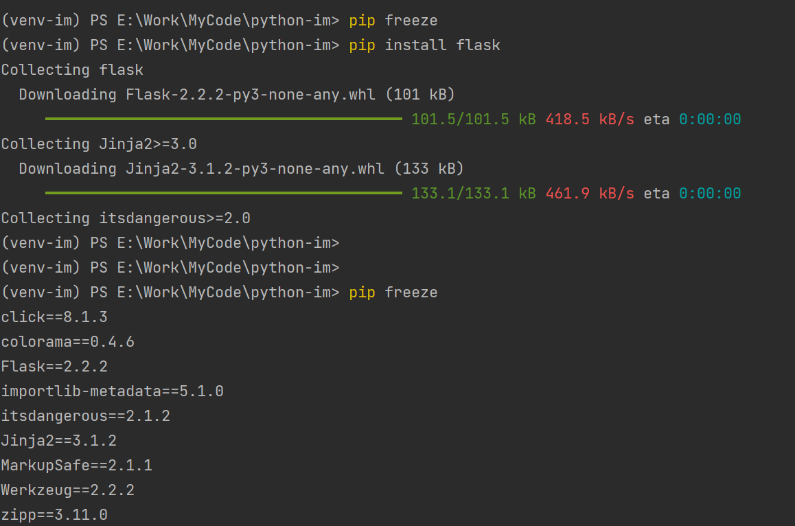
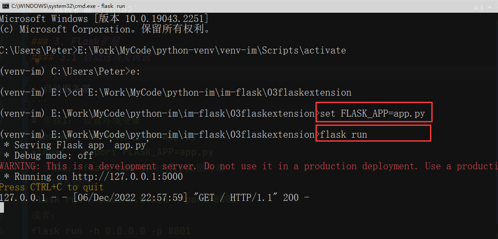
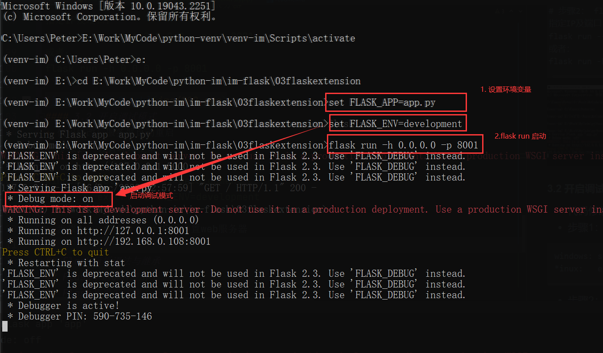
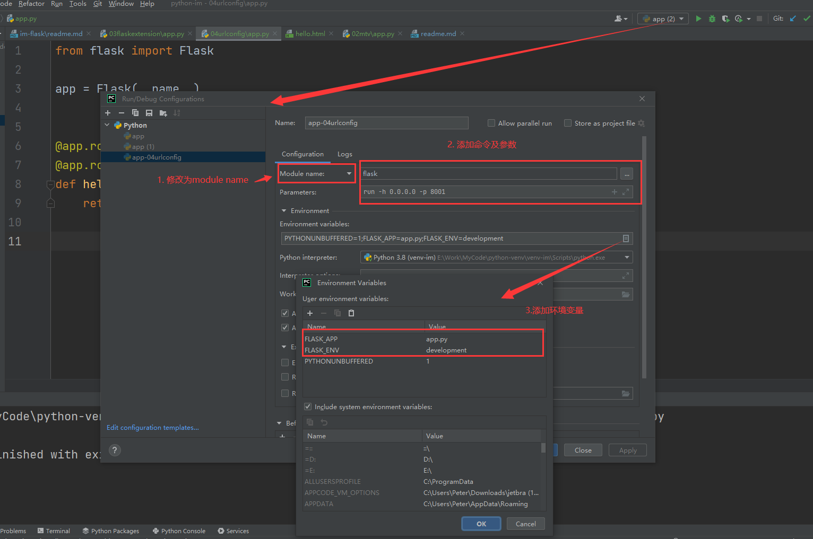

# Flask
## 入门Flask微框架
### 1. 入门Flask框架
#### 1.1 基本介绍
+ [Flask](https://flask.palletsprojects.com/en/2.2.x/)是Python实现的Web开发微框架
+ 小而美，丰富的周边扩展
+ flask的特点
  + 轻松掌握
  + 灵活掌握
  + 免费开源[源码](https://github.com/pallets/flask)
#### 1.2 安装flask
+ linux创建虚拟环境
```
# 创建虚拟环境  
virtualenv venv-im
# 激活虚拟环境  
source venv-im/bin/activate
#退出虚拟环境  
deactivate`
```
+ windows创建虚拟环境
```
# 创建虚拟环境 
cd E:\Work\MyCode\python-venv\
virtualenv venv-im  
# 激活虚拟环境
E:\Work\MyCode\python-venv\venv-im\Scripts\activate
# 退出虚拟环境
deactivate
```
+ 第一种使用pip命令安装 
```
pip install flask
pip install -i http://pypi.douban.com/simple/ --trusted-host pypi.douban.com flask
```

+ 第二种 [源码](https://files.pythonhosted.org/packages/69/b6/53cfa30eed5aa7343daff36622843688ba8c6fe9829bb2b92e193ab1163f/Flask-2.2.2.tar.gz)安装  
```
wget https://files.pythonhosted.org/packages/69/b6/53cfa30eed5aa7343daff36622843688ba8c6fe9829bb2b92e193ab1163f/Flask-2.2.2.tar.gz
gzip -dc Flask-2.2.2.tar.gz | tar xvf -
cd Flask-2.2.2
python setup.py install
```
+ 验证是否已经安装成功
```
(venv-im) PS E:\Work\MyCode\python-im> python
Python 3.8.6 (tags/v3.8.6:db45529, Sep 23 2020, 15:52:53) [MSC v.1927 64 bit (AMD64)] on win32
Type "help", "copyright", "credits" or "license" for more information.                        
>>> import flask
>>> flask.__version__
'2.2.2'
>>>
```
#### 1.3 第一个Flask程序
```
from flask import Flask

app = Flask(__name__)  

@app.route('/')
def  hello_word():
     return 'Hello World!'
```
### 2. MTV（Model、Template、View）模型
+ 1. 视图View
  - 视图扩展 `Flask-WTF / bootstrap-flask  / Flask-Uploads`
+ 2. 模型Model 
  - 模型扩展 `Flask-PyMongo / Flask-MongoKit / Flask-SQLAlchemy`
+ 3. 模板Template
  - 模板扩展`Jinja2`

### 3. Flask扩展
#### 3.1 启动选项及调试
+ 代码
```
from flask import Flask

app = Flask(__name__)


@app.route("/")
@app.route("/index")
def hello_world():
    return "Hello world in flask extension"


# v1.0 之后的版本，不推荐的写法
# if __name__ == "__main__":
#     app.run()
```
+ 启动服务器
```
# 步骤1： 设置环境变量
windows: set FLASK_APP=app.py
*inux:   export FLASK_APP=app.py
# 步骤2： flask run 启动内置web服务器
指定IP及端口：
flask run --host=0.0.0.0 --port=8001
或者：
flask run -h 0.0.0.0 -p 8001
```

#### 3.2 开启调试模式
+ 代码修改后服务器自动重启
+ 步骤1： 设置环境变量
```
windows: set FLASK_ENV=development
*inux:   export FLASK_ENV=development
```
+ 步骤2： `flask run`启动内置web服务器


#### 3.3开启调试模式v1.0以前
+ 直接执行app.py(v1.0以前)
+ 步骤1： 在文件中添加启动代码
```
if __name__ == "__main__":
    app.run(debug=True)
```
+ 步骤2：`python app.py`
> 提示： 切勿在生产环境下开启调试模式

#### 3.4 Flask的扩展
+ 什么是扩展： 为Flask应用增加功能的包
+ 有哪些常用的Flask扩展？
  + `Flask SQLAlchemy`
  + `Flask WTF`
  + `Flask mail`
  + `Flask RESTful`
+ [Flask的扩展](https://pypi.org/)
+ 为Flask写扩展
  + [英文链接](https://flask.palletsprojects.com/en/1.1.x/extensiondev/)
  + [中文链接](https://dormousehole.readthedocs.io/en/latest/extensiondev.html#extension-dev)
### 4.http基础知识
#### 4.1 URL及Http基础知识
+ 基本URL包含模式（或者协议）、服务器名称（或IP地址）、路径和文件名
`scheme://host[:port#]/path/.../[;url-params][?querey-string][#anchor]`
+ URL协议
  + http 超文本传输协议资源
  + https 用安全套接字层传送的超文本传输协议
  + ftp 文件传输协议
+ HTTP请求
  + GET
    + 可以用浏览器直接访问
    + 请求可以携带参数，但是有长度限制
    + 请求参数直接放在URL后面
  + POST
    + 不能使用浏览器直接访问
    + 对请求参数的长度没有限制
    + 可以用来上传文件等需求
+ HTTP常见状态码
  + 2xx 请求成功
  + 3xx 重定向
  + 4xx 请求错误
  + 5xx 服务器错误
#### 4.2 Url配置及路由
+ Pycharm配置调试模式

+ 路由配置
  + 方式一：使用装饰器 `@app.route(url_name, methods)`
  + 方式二：使用API配置 `app.add_url_rule(url,url_name,view_name)`
+ 方式一： 使用装饰器
  + 语法规则 `@app.route(url_name, methods)`
  + 参数解释
    + url：匹配的URL地址
    + methods：所支持的请求方式`(['GET','POST'])`
  + 示例： `@app.route("/login",methods=['GET','POST'])`
+ 方式二： 使用API配置
  + 语法规则 `app.add_url_rule(url,url_name,view_name)`
  + 参数解释
    + url： 匹配的URL地址
    + url_name: 给URL的命名
    + view_name: 视图函数
#### 4.3 路由匹配规则
+ 匹配整个文字 `@app.route("/hello")`
+ 传递参数  `@app.route("/user/< username >")`
+ 指定参数类型 `@app.route("/post/< int:post_id >")`
+ URL参数类型
  | 类型   | 描述                                |
  | ------ | ----------------------------------- |
  | string | 接受任何不包含斜杠 的文本（默认值） |
  | int    | 接受正整数                          |
  | float  | 接受正浮点数                        |
  | path   | 类似string，但可以包含斜杠          |
  | uuid   | 接受UUID字符串                      |
+ 查看URL规则列表 `app.url_map`
+ URL逆向解析（根据名称解析成URL字符串)
  + `url_for(url_name,**kwargs)`
  + 静态文件(js/css/图片)引用`url_for('static',filename='style.css')`

#### 4.4 视图函数中获取页面传值
+ URL中的值
```
@app.route("/page/<page>")
def list_user(page):
  return "您好，你是第{}页用户".format(page)
```
+ URL中的值为可选,一般在分页中经常用到，添加一个`@app.route("/user1/")`
```
@app.route("/user1/")
@app.route("/user1/<page>")
def list_user_opt(page=1):
    return "您好，你是user1第{}页用户".format(page)
```
### 5. flask请求与响应报文
### 6. flask视图

## Flask模板语法与继承
## Flask中的ORM使用
## Flask表单的实现

## Pycharm快捷键
ctrl+shift+f10 ：运行脚本
ctrl+/ ：注释行
ctrl+p ：查看函数参数
ctrl+Space ：基本的代码完成,可以根据需要调整 Ctrl + J
shift+enter ：另起一行
Alt + Enter : import导入
Ctrl + Alt + Space : 快速导入任意类
Ctrl + F12       弹出文件结构
Ctrl + H          类型层次结构
Ctrl + Shift + H   方法层次结构
Ctrl + Alt + H     调用层次结构
## Refer
+ [flask](https://flask.palletsprojects.com/en/2.2.x/)
+ [flask](https://dormousehole.readthedocs.io/en/latest/quickstart.html)
+ [flask 源码](https://github.com/pallets/flask)
+ [pypi](https://pypi.org/)
+ [英文链接](https://flask.palletsprojects.com/en/1.1.x/extensiondev/)
+ [中文链接](https://dormousehole.readthedocs.io/en/latest/extensiondev.html#extension-dev)